```{r setup, include=FALSE}
knitr::opts_chunk$set(echo = TRUE)
```
\


# Boys and Girls! Single and Married! Wanna be Happy!? {align=center}
\


*******
\


> In this project, I would like to define the distiction between what defines "Happiness" among different genders and marital status. This would be a crutial database which could be used as a cornerstone of development of any dating application such as Tinder and eharmony. 

\


*******
## What do overall people think as their Happy Moment?


### Let's first examine the result from WordCloud.


> WordCloud will return the n number of words that was most frequently used in HappyDB. By observing these analysis first, we will be able to grasp what makes the overall people happy before we delve into different groups of people such as gender and marital status. 

*******

 | 
:-: | :-: 
**5 words** | **10 words**
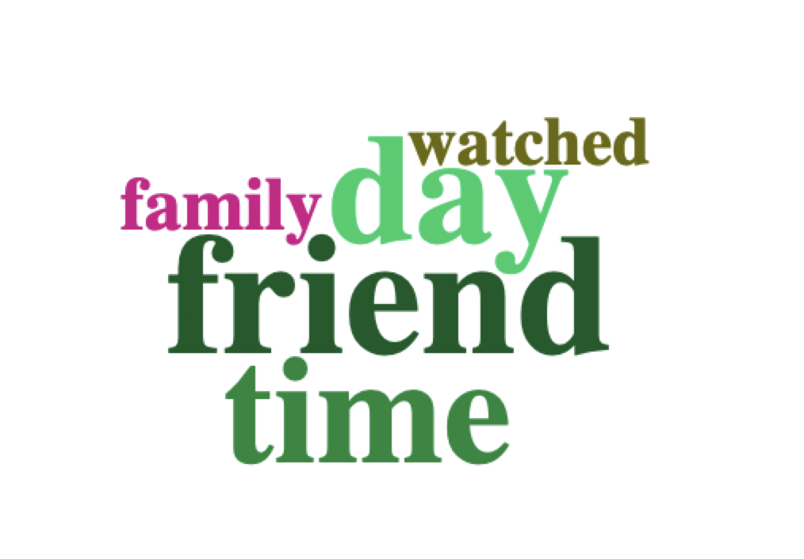{ width=100% } | 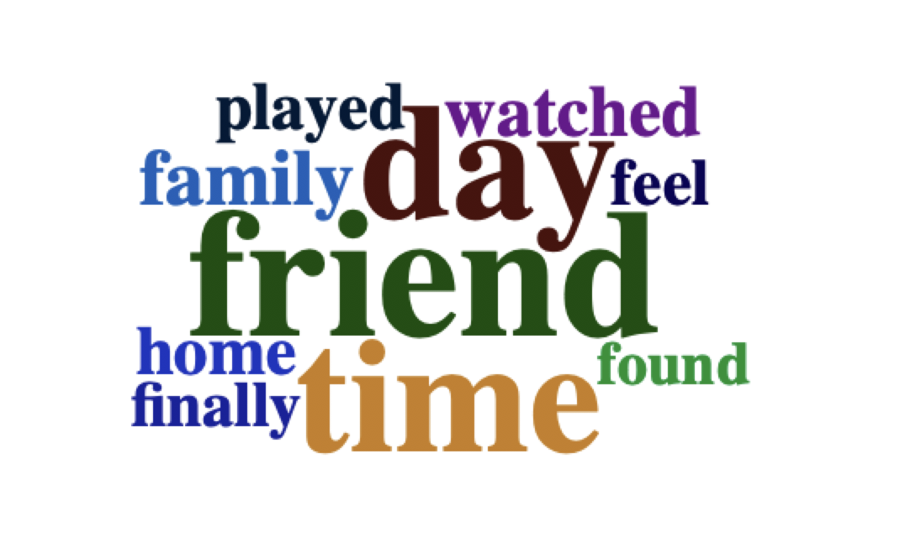{ width=100% }
**15 words** | **20 words**
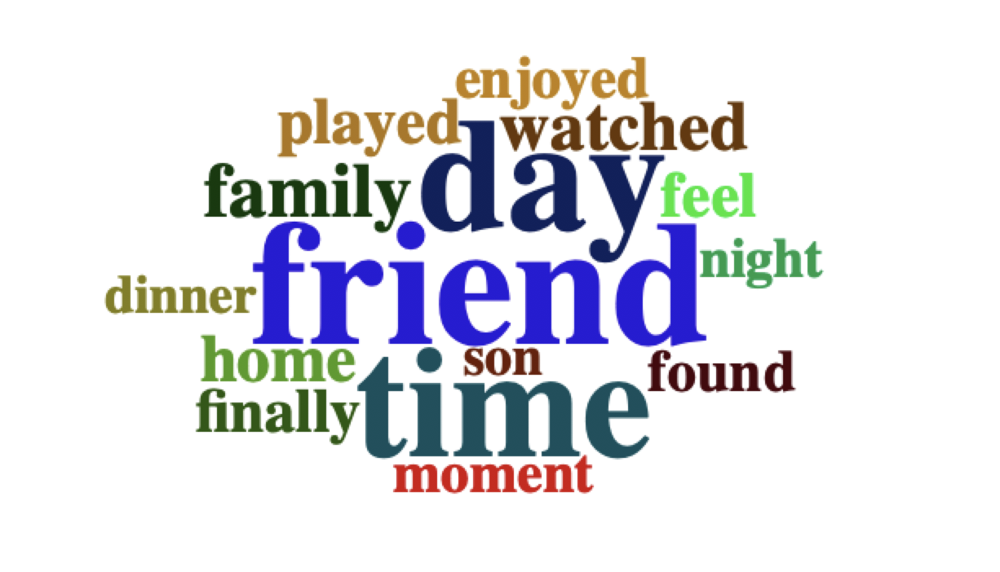{ width=100% } | 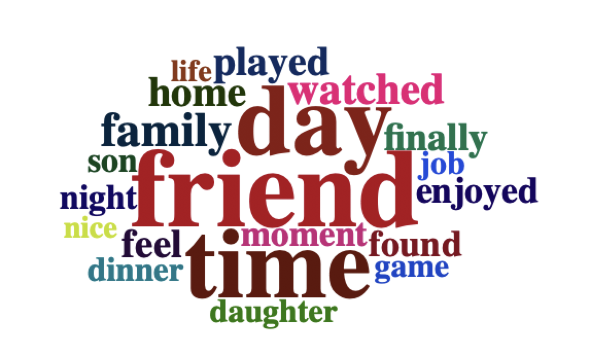{ width=100% }
**25 words** | **30 words**
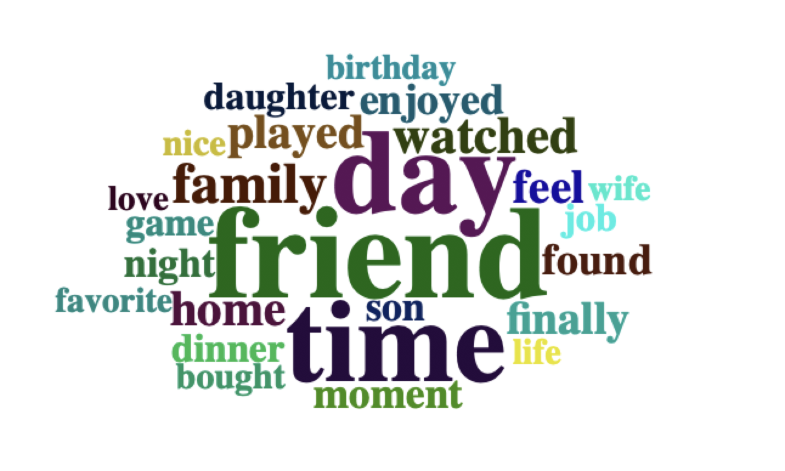{ width=100% } | 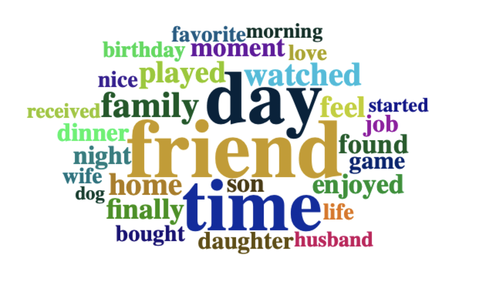{ width=100% }
**40 words** | **50 words**
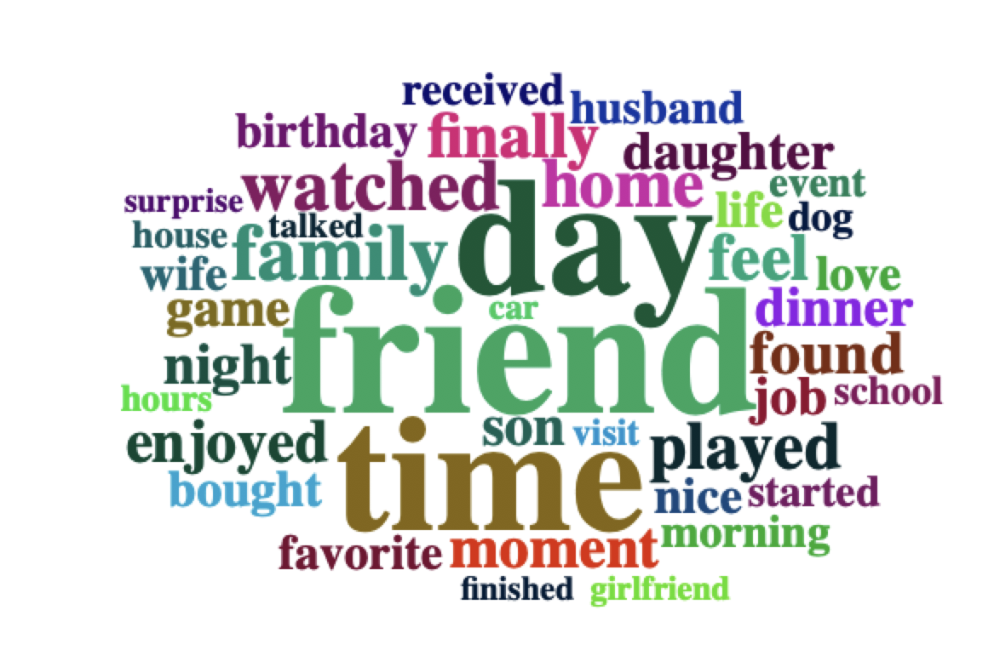{ width=100% } | 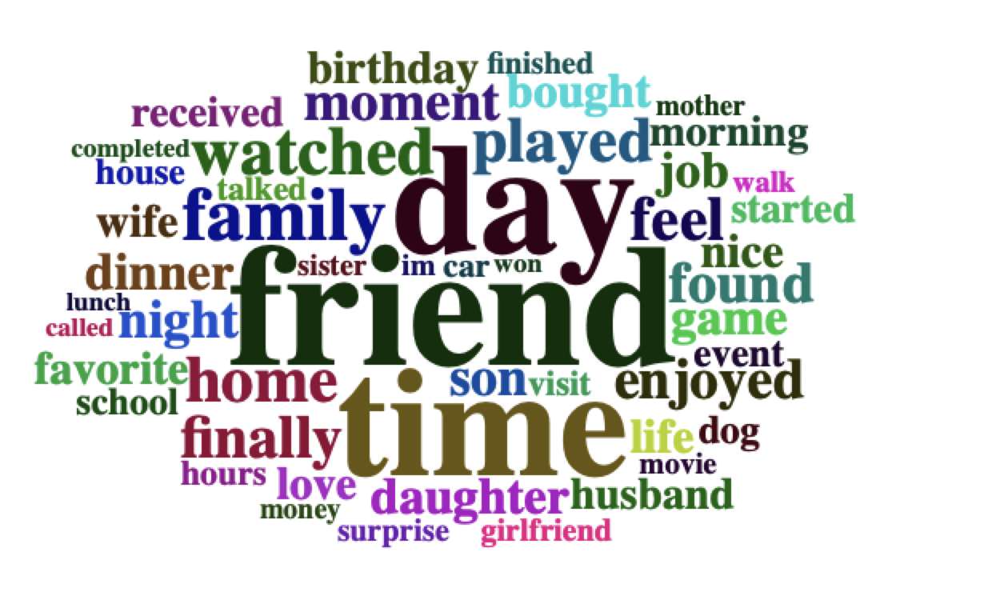{ width=100% }

> As we increased the number of words, 
>
> We can see there are various of values/relationships that impact the Happiness of people.
>
> Let's sort these values into smaller subgroups for our better analysis.


\


*******

## 5 Major Topics of Happy Moment

> This section I used topic modeling to factor out 5 most significant topics among all the moments that make people happy. 

\

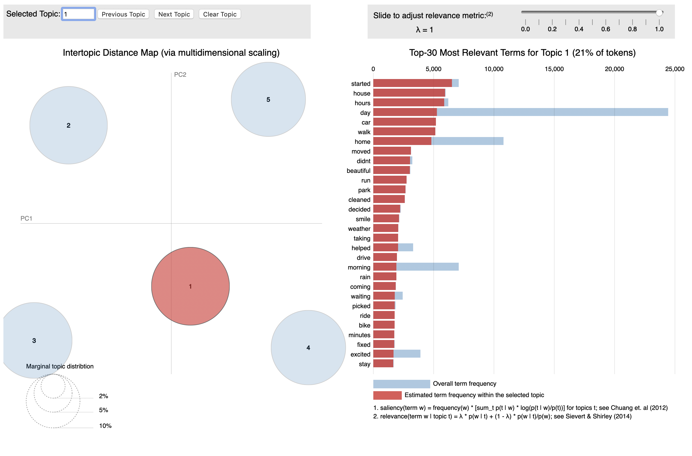{ width=100% }


\


> The first topic, we can infer that these are about exercise, being motivated and early.


\

******


\


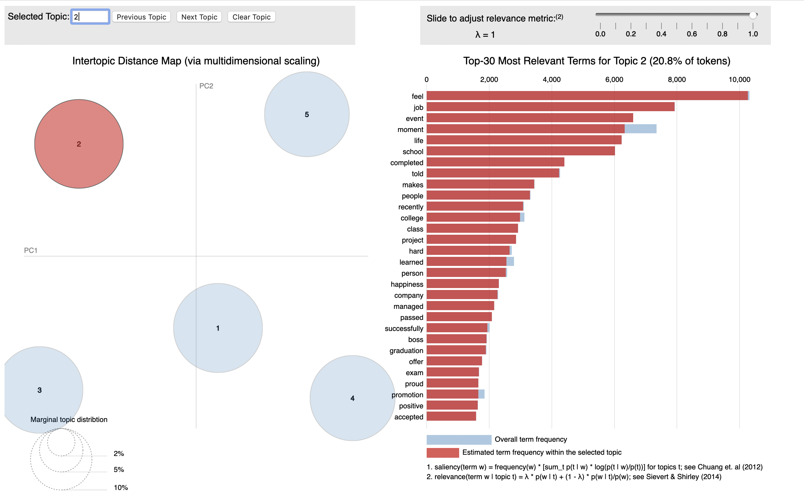{ width=100% }


\


> The second topic, we can infer that these are about work and job.


\

******


\


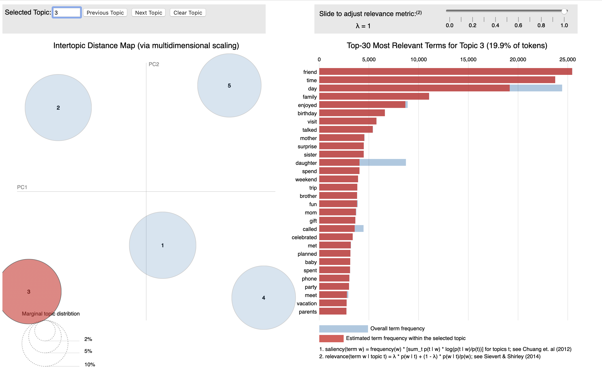{ width=100% }


\


> The third topic, we can infer that these are about friendship and relationship.


\


******


\


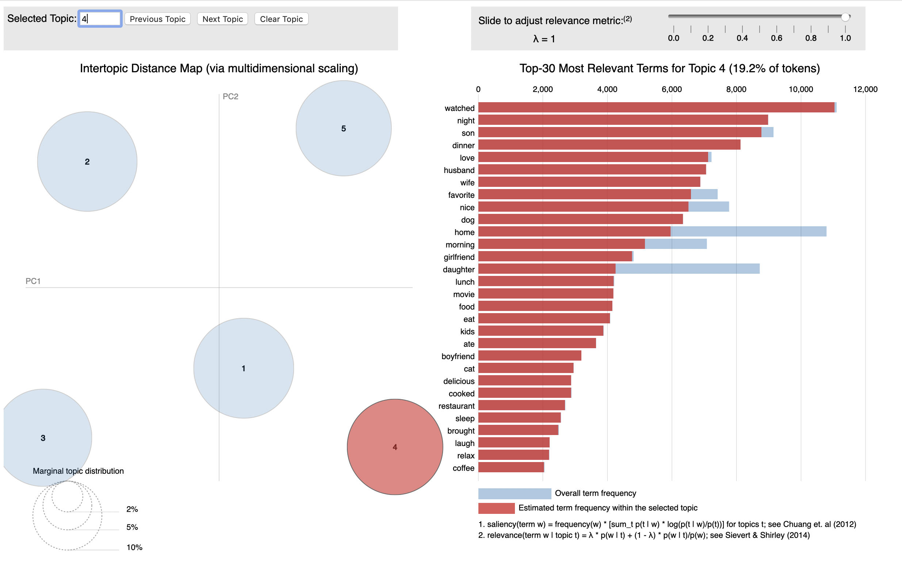{ width=100% }


\


> The fourth topic, we can infer that these are about love and family.


\

******


\


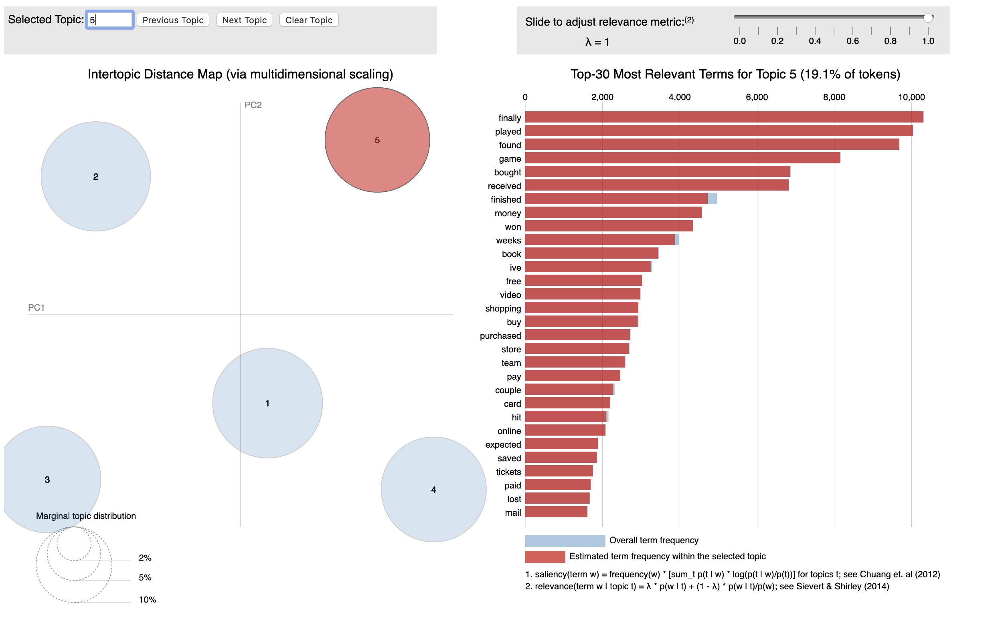{ width=100% }


\


> The fifth topic, we can infer that these are about entertainment.


\


> Summary: the 5 major topics that people feel happy are being motivated, security in their jobs, friendship & relationship, family & love, and entertainment. 


\


******

## Among different values, we are going to examine how those factors affect the different groups of people. 


> We are going to divide into two subtopics.
>
> \ 1. Difference between genders
>
> \ 2. Difference between marital status
>
> We are going to analyze by using proportion difference of two groups.


******

### Difference btween genders

> Let's look at the Comparison of Proportion graph of male and female.

\

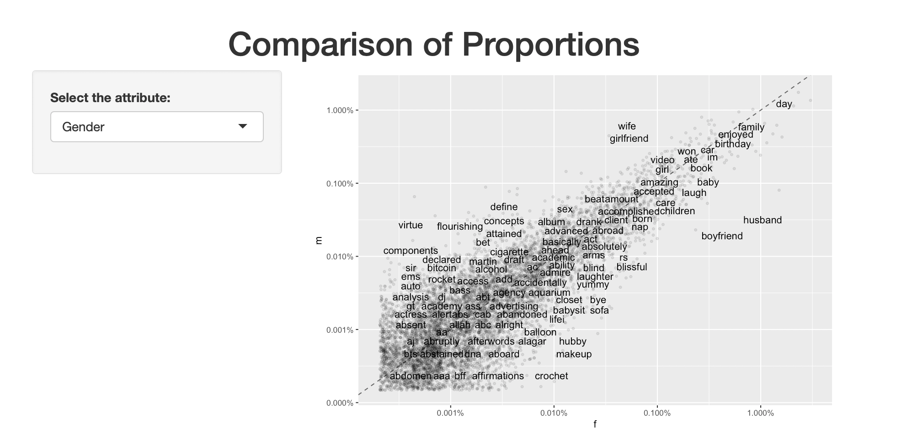{ width=100% }

> Obvious result came out.
>
> Males feel happy with their wife, girlfriend.
>
> Females feel happy with their husband and boyfriend.

#### More analysis

> One interesting inference we can do it about how males prefer investing and gambling as the words "bitcoin" and "bet" were more towards male in the graph. Another interseting inference (or obvious) is that female feel more happy with "makeup". There are more analysis we can do with this Comparison of Proportions graph; however, I will just list some interesting words that are more towards a certain gender.
>
> Male: auto, video, cigarrete, alcohol, dj, and etc.
> 
> Female: closet, nap, laugh, aboard, aquarium
>
> Summary: By analyzing these data this way, one gender would be able to find better ways to understand the opposite gender. (pun intended)


******

### Difference btween marital status

> Let's look at the Comparison of Proportion graph of marital status

\

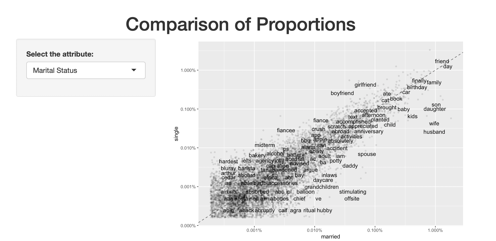{ width=100% }


> Obvious result came out.
>
> Single feel happy with their boyfriend and girlfriend
>
> Married feel happy with their husband and wife.

#### More analysis

> One interesting inference we can do it about how married people are happy with their kids -- as children, son, and daughter came out to be more towards married people. Another interseting inference (or obvious) is that single feel more happy with "text". By which describes the situation where single people text each other a lot in order to feel happy. On the other hand, married people are happy with their anniversary since married people are more tends to keep track of their anniversary. There are more analysis we can do with this Comparison of Proportions graph; however, I will just list some interesting words that are more towards a certain gender.
>
> Single: fiance, airbnb, alcohol, midterm
> 
> Married: daycare, car, family
>
> Summary: By analyzing these data this way, one can analyze the gap between how single and married people feel happy about. 

******


```{r echo=FALSE, warning=FALSE, message=FALSE}

## Loading all necessary libaraies

library(tidyverse)
library(tidytext)
library(DT)
library(scales)
library(wordcloud2)
library(gridExtra)
library(ngram)
library(shiny)
library(tm)
library(topicmodels)
library(LDAvis)
library(servr)
library(dplyr)
library(stringi) 
```

```{r echo=FALSE, warning=FALSE, message=FALSE}

## Read in data file (preprocessed)

hm <- read.csv("../output/processed_moments.csv")
hm <- hm[0:100000,]

```


```{r echo=FALSE, warning=FALSE, message=FALSE}

## Aggregate the data

hm_byusers <- aggregate(x = hm$hmid, by = list(hm$text), paste, collapse=". ")
colnames(hm_byusers) <- c("text", "hmid")

```


```{r echo=FALSE, warning=FALSE, message=FALSE}

## Converting texts into corpus

hm_byusers_corpus <- iconv(hm_byusers$text)
corpus <- Corpus(VectorSource(hm_byusers_corpus))

```


```{r echo=FALSE, warning=FALSE, message=FALSE}

## Construct a document-term matrix (DTM)

dtm <- DocumentTermMatrix(corpus)

```


```{r echo=FALSE, warning=FALSE, message=FALSE}

## Remove empty documents from DTM

rowTotals<-apply(dtm,1,sum) #running this line takes time
empty.rows<-dtm[rowTotals==0,]$dimnames[1][[1]]
corpus<-corpus[-as.numeric(empty.rows)]
dtm <- DocumentTermMatrix(corpus)

```


```{r echo=FALSE, warning=FALSE, message=FALSE}

## Finding the frequency of different terms

dtm.mx <- as.matrix(dtm)
frequency <- colSums(dtm.mx)
frequency <- sort(frequency, decreasing=TRUE)
frequency[1:25]

```

```{r echo=FALSE, warning=FALSE, message=FALSE}

## Setting parameters for LDA (topic modeling)

burnin <- 4000
iter <- 2000
thin <- 500
seed <-list(2003,5,63,100001,765)
nstart <- 5
best <- TRUE

## Find 5 topics

k <- 5

```


```{r echo=FALSE, warning=FALSE, message=FALSE}

## Running Topic Modeling using Gibbs method

ldaOut <-LDA(dtm,k, method="Gibbs", control=list(nstart=nstart, seed = seed, best=best, burnin = burnin, iter = iter, thin=thin))

```

```{r echo=FALSE, warning=FALSE, message=FALSE}

ldaOut.topics <- as.matrix(topics(ldaOut))
write.csv(ldaOut.topics,file=paste("topic_model",k,"DocsToTopics.csv"))

```

```{r echo=FALSE, warning=FALSE, message=FALSE}

## Finding keywords associated with each topic

ldaOut.terms <- as.matrix(terms(ldaOut,10))
write.csv(ldaOut.terms,file=paste("topic_model",k,"TopicsToTerms.csv"))
ldaOut.terms[1:10,]

```

```{r echo=FALSE, warning=FALSE, message=FALSE}

## To visualize the topic modeling result

topicmodels2LDAvis <- function(x, ...){
  post <- topicmodels::posterior(x)
  if (ncol(post[["topics"]]) < 3) stop("The model must contain > 2 topics")
  mat <- x@wordassignments
  LDAvis::createJSON(
    phi = post[["terms"]],
    theta = post[["topics"]],
    vocab = colnames(post[["terms"]]),
    doc.length = slam::row_sums(mat, na.rm = TRUE),
    term.frequency = slam::col_sums(mat, na.rm = TRUE)
  )
}

serVis(topicmodels2LDAvis(ldaOut))

```


```{r echo=FALSE, warning=FALSE, message=FALSE}

## Now running analysis using Shiny App
## Load new set of data and combine it with the demographic information available.

hm_data <- read_csv("../output/processed_moments.csv")

urlfile<-'https://raw.githubusercontent.com/rit-public/HappyDB/master/happydb/data/demographic.csv'
demo_data <- read_csv(urlfile)

```

```{r echo=FALSE, warning=FALSE, message=FALSE}


## Combine both the data sets and keep the required columns for analysis

hm_data <- hm_data %>%
  inner_join(demo_data, by = "wid") %>%
  select(wid,
         original_hm,
         gender,
         marital,
         parenthood,
         reflection_period,
         age,
         country,
         ground_truth_category,
         text) %>%
  mutate(count = sapply(hm_data$text, wordcount)) %>%
  filter(gender %in% c("m", "f")) %>%
  filter(marital %in% c("single", "married")) %>%
  filter(parenthood %in% c("n", "y")) %>%
  filter(reflection_period %in% c("24h", "3m")) %>%
  mutate(reflection_period = fct_recode(reflection_period,
                                        months_3 = "3m", hours_24 = "24h"))
```

```{r echo=FALSE}
datatable(hm_data)
```

```{r echo=FALSE, warning=FALSE, message=FALSE}

## Create a bag of words using the text data

bag_of_words <-  hm_data %>%
  unnest_tokens(word, text)

word_count <- bag_of_words %>%
  count(word, sort = TRUE)
```


```{r echo=FALSE, warning=FALSE, message=FALSE}

### Create bigrams using the text data

hm_bigrams <- hm_data %>%
  filter(count != 1) %>%
  unnest_tokens(bigram, text, token = "ngrams", n = 2)

bigram_counts <- hm_bigrams %>%
  separate(bigram, c("word1", "word2"), sep = " ") %>%
  count(word1, word2, sort = TRUE)

```


```{r echo=FALSE, warning=FALSE, message=FALSE}

### Specify the user interface for the R Shiny app

ui <- navbarPage("What makes people happy?",
                 tabPanel("Overview",

                          titlePanel(h1("Most Frequent Occurrences",
                                        align = "center")),

                          sidebarLayout(
                            sidebarPanel(
                              sliderInput(inputId = "topWordcloud",
                                          label = "Number of terms for word cloud:",
                                          min = 5,
                                          max = 100,
                                          value = 50),
                              br(),
                              br(),

                              checkboxInput(inputId = "topFreqB",
                                            label = "Plot Bar Chart",
                                            value = F),
                              sliderInput(inputId = "topBarchart",
                                          label = "Number of terms for bar chart:",
                                          min = 1,
                                          max = 25,
                                          value = 10),
                              br(),
                              br(),

                              checkboxInput(inputId = "topFreqN",
                                            label = "Plot Network Graph",
                                            value = F),
                              sliderInput(inputId = "topNetwork",
                                          label = "Number of edges for network graph:",
                                          min = 1,
                                          max = 150,
                                          value = 50)
                            ),

                            mainPanel(
                              wordcloud2Output(outputId = "WC"),
                              plotOutput(outputId = "figure")
                            )
                          )
                 ),

                 tabPanel("Individual Terms",

                          titlePanel(h1("Comparison of Proportions",
                                        align = "center")),

                          sidebarLayout(
                            sidebarPanel(
                              selectInput(inputId = "attribute",
                                          label = "Select the attribute:",
                                          choices = c("Gender" = "gender",
                                                      "Marital Status" = "marital",
                                                      "Parenthood" = "parenthood",
                                                      "Reflection Period" = "reflection_period")
                              )
                            ),

                            mainPanel(
                              plotOutput(outputId = "scatter")
                            )
                          )
                 ),

                 tabPanel("Pair of Words",

                          titlePanel(h1("Most Frequent Bigrams",
                                        align = "center")),

                          sidebarLayout(
                            sidebarPanel(
                              selectInput(inputId = "factor",
                                          label = "Select the attribute:",
                                          choices = c("Gender" = "gender",
                                                      "Marital Status" = "marital",
                                                      "Parenthood" = "parenthood",
                                                      "Reflection Period" = "reflection_period")
                              ),
                              numericInput(inputId = "topBigrams",
                                          label = "Number of top pairs to view:",
                                          min = 1,
                                          max = 25,
                                          value = 10)
                            ),

                            mainPanel(
                              plotOutput(outputId = "bar")
                            )
                          )
                 ),

                 tabPanel("Data",
                          DT::dataTableOutput("table")
                          )
)
```

```{r echo=FALSE, warning=FALSE, message=FALSE}
server <- function(input, output, session) {

  pt1 <- reactive({
    if(!input$topFreqB) return(NULL)
    word_count %>%
      slice(1:input$topBarchart) %>%
      mutate(word = reorder(word, n)) %>%
      ggplot(aes(word, n)) +
      geom_col() +
      xlab(NULL) +
      ylab("Word Frequency")+
      coord_flip()
  })

  pt2 <- reactive({
    if(!input$topFreqN) return(NULL)
    bigram_graph <- bigram_counts %>%
      slice(1:input$topNetwork) %>%
      graph_from_data_frame()

    set.seed(123)

    x <- grid::arrow(type = "closed", length = unit(.1, "inches"))

    ggraph(bigram_graph, layout = "fr") +
      geom_edge_link(aes(edge_alpha = n), show.legend = FALSE,
                     arrow = x, end_cap = circle(.05, 'inches')) +
      geom_node_point(color = "skyblue", size = 3) +
      geom_node_text(aes(label = name), repel = TRUE) +
      theme_void()
  })

  output$WC <- renderWordcloud2({

    word_count %>%
      slice(1:input$topWordcloud) %>%
      wordcloud2(size = 0.6,
                 rotateRatio = 0)

  })

  output$figure <- renderPlot(height = 500, width = 500, {

    ptlist <- list(pt1(),pt2())
    ptlist <- ptlist[!sapply(ptlist, is.null)]
    if(length(ptlist)==0) return(NULL)

    lay <- rbind(c(1,1),
                 c(2,2))

    grid.arrange(grobs = ptlist, layout_matrix = lay)
  })


  selectedAttribute <- reactive({
    list(atr = input$attribute)
  })

  output$scatter <- renderPlot({
    temp <- bag_of_words %>%
      count(!!as.name(selectedAttribute()$atr), word) %>%
      group_by(!!as.name(selectedAttribute()$atr)) %>%
      mutate(proportion = n / sum(n)) %>%
      select(-n) %>%
      spread(!!as.name(selectedAttribute()$atr), proportion)

      ggplot(temp,
             aes_string(x = colnames(temp)[2], y = colnames(temp)[3]),
             color = abs(colnames(temp)[3] - colnames(temp)[2])) +
      geom_abline(color = "gray40", lty = 2) +
      geom_jitter(alpha = 0.1, size = 1, width = 0.3, height = 0.3) +
      geom_text(aes(label = word), check_overlap = TRUE, vjust = 1.5) +
      scale_x_log10(labels = percent_format()) +
      scale_y_log10(labels = percent_format()) +
      scale_color_gradient(limits = c(0, 0.001), low = "darkslategray4", high = "gray75") +
      theme(legend.position="none")
  })


  selectedBigram <- reactive({
    list(var = input$factor)
  })

  output$bar <- renderPlot({
    hm_bigrams %>%
      count(!!as.name(selectedBigram()$var), bigram, sort = TRUE) %>%
      group_by(!!as.name(selectedBigram()$var)) %>%
      top_n(input$topBigrams) %>%
      ungroup() %>%
      mutate(bigram = reorder(bigram, n)) %>%
      ggplot(aes(bigram, n, fill = !!as.name(selectedBigram()$var))) +
      geom_col(show.legend = FALSE) +
      facet_wrap(as.formula(paste("~", selectedBigram()$var)), ncol = 2, scales = "free") +
      coord_flip()
  })

  output$table <- DT::renderDataTable({
    DT::datatable(hm_data)
  })
}
```

```{r echo=FALSE, warning=FALSE, message=FALSE}
shinyApp(ui, server, options = list(height = 500))

```
